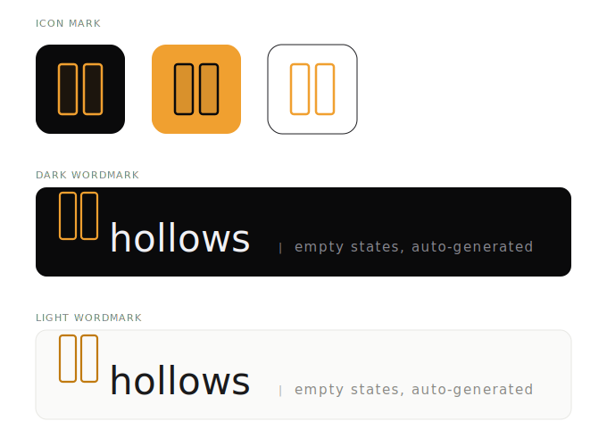

<p align="center">
  
</p>

<h3 align="center">
  Contextual empty states, extracted from your real UI
</h3>

<p align="center">
  React &middot; Vue &middot; Svelte &middot; Angular
</p>

<p align="center">
  <a href="https://www.npmjs.com/package/hollows-ui"></a>
  <a href="https://www.npmjs.com/package/hollows-ui"></a>
  <a href="https://github.com/oliver-gomes/hollows-ui/blob/main/LICENSE"></a>
  <a href="https://img.shields.io/bundlephobia/minzip/hollows-ui"></a>
</p>

---

## Quick Start

```bash
npm install hollows-ui
```

### React

```tsx
import { Hollow } from 'hollows-ui/react'
import './hollows/registry'

function Inbox({ messages, isLoading }) {
  return (
    <Hollow
      name="user-inbox"
      loading={isLoading}
      empty={messages?.length === 0}
      onAction={() => navigate('/compose')}
    >
      <InboxList items={messages} />
    </Hollow>
  )
}
```

### Vue

```vue
<script setup>
import { Hollow } from 'hollows-ui/vue'
import { ref } from 'vue'

const messages = ref([])
const loading = ref(true)
</script>

<template>
  <Hollow
    name="user-inbox"
    :loading="loading"
    :empty="messages.length === 0"
    @action="$router.push('/compose')"
  >
    <InboxList :items="messages" />
  </Hollow>
</template>
```

### Svelte

```svelte
<script>
  import { Hollow } from 'hollows-ui/svelte'

  export let messages = []
  export let loading = false
</script>

<Hollow
  name="user-inbox"
  {loading}
  empty={messages.length === 0}
  on:action={() => goto('/compose')}
>
  <InboxList items={messages} />
</Hollow>
```

### Angular

```typescript
@Component({
  template: `
    <hollow
      name="user-inbox"
      [loading]="loading"
      [empty]="messages.length === 0"
      (action)="onCompose()"
    >
      <app-inbox-list [items]="messages" />
    </hollow>
  `,
})
export class InboxComponent {
  messages: Message[] = []
  loading = false
}
```

---

## Generation

### CLI

```bash
# Scan your running dev server and generate empty states
npx hollows-ui build

# Watch mode — regenerate on file changes
npx hollows-ui watch

# Generate for a specific component
npx hollows-ui build --name user-inbox
```

### Registry

```tsx
// Import once in your app entry point
import './hollows/registry'
```

Every `<Hollow>` component auto-resolves its empty state by name from the generated registry.

---

## How It Works

1. **Scan** — The CLI finds all `<Hollow name="...">` usages in your codebase via AST parsing
2. **Analyze** — Optionally launches Playwright to capture the rendered DOM and extract design tokens
3. **Classify** — Detects the component type (inbox, table, search, cart, feed, etc.) using heuristics
4. **Generate** — Creates contextual illustration, headline, description, and CTA for each component
5. **Write** — Outputs `.hollows.json` descriptors and a `registry.js` to your project

Empty states inherit your app's color scheme, fonts, and border radii automatically.

---

## CLI Flags

| Flag | Description |
|------|-------------|
| `--name <name>` | Generate for a specific component only |
| `--browser` | Use Playwright for DOM analysis |
| `--verbose` | Show detailed output including file paths |
| `-o, --out <dir>` | Output directory for exported illustrations |

---

## Props

| Prop | Type | Default | Description |
|------|------|---------|-------------|
| `name` | `string` | — | Unique identifier matching the generated empty state |
| `loading` | `boolean` | `false` | Show loading skeleton |
| `empty` | `boolean` | `false` | Show generated empty state |
| `showCta` | `boolean` | `true` | Show or hide the CTA button |
| `onAction` | `() => void` | — | Callback when CTA button is clicked |
| `theme` | `string` | `"minimal"` | Theme: `minimal`, `playful`, `corporate`, or custom |
| `customCopy` | `object` | — | Override `headline`, `description`, and/or `cta` text |
| `customIllustration` | `ReactNode` | — | Replace the auto-generated illustration |
| `className` | `string` | — | CSS class for the wrapper |
| `style` | `CSSProperties` | — | Inline styles for the wrapper |

---

## Config

Create `hollows.config.json` in your project root:

```json
{
  "devServer": "http://localhost:3000",
  "outDir": "src/hollows",
  "theme": "minimal",
  "copy": {
    "tone": "friendly",
    "language": "en"
  },
  "classifierOverrides": {
    "user-inbox": "inbox",
    "product-grid": "card-grid"
  },
  "ignore": ["debug-panel", "admin-*"],
  "breakpoints": {
    "mobile": 375,
    "tablet": 768,
    "desktop": 1280
  }
}
```

---

## Exports

| Path | Description |
|------|-------------|
| `hollows-ui` | Core types, classifier, copy generator, themes |
| `hollows-ui/react` | `<Hollow>` React component |
| `hollows-ui/vue` | Vue 3 adapter |
| `hollows-ui/svelte` | Svelte adapter |

---

## Built-in Illustrations

13 minimal line-art SVGs that adapt to your color scheme via `currentColor`:

`inbox-empty` · `search-no-results` · `list-empty` · `table-empty` · `chart-no-data` · `feed-empty` · `cart-empty` · `favorites-empty` · `notifications-empty` · `upload-empty` · `comments-empty` · `error-state` · `generic-empty`

---

## Themes

Three built-in themes with custom theme support:

```tsx
import { createTheme } from 'hollows-ui'

const custom = createTheme({
  name: 'brand',
  cta: {
    borderRadius: '24px',
    background: '#6366f1',
    color: '#ffffff',
  },
})
```

`minimal` · `playful` · `corporate`

---

<p align="center">
  <a href="https://hollows-ui.vercel.app">Documentation</a> &middot;
  <a href="https://www.npmjs.com/package/hollows-ui">npm</a>
</p>

## License

[MIT](LICENSE)
